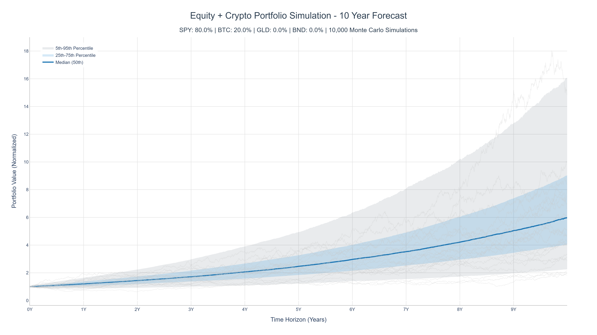
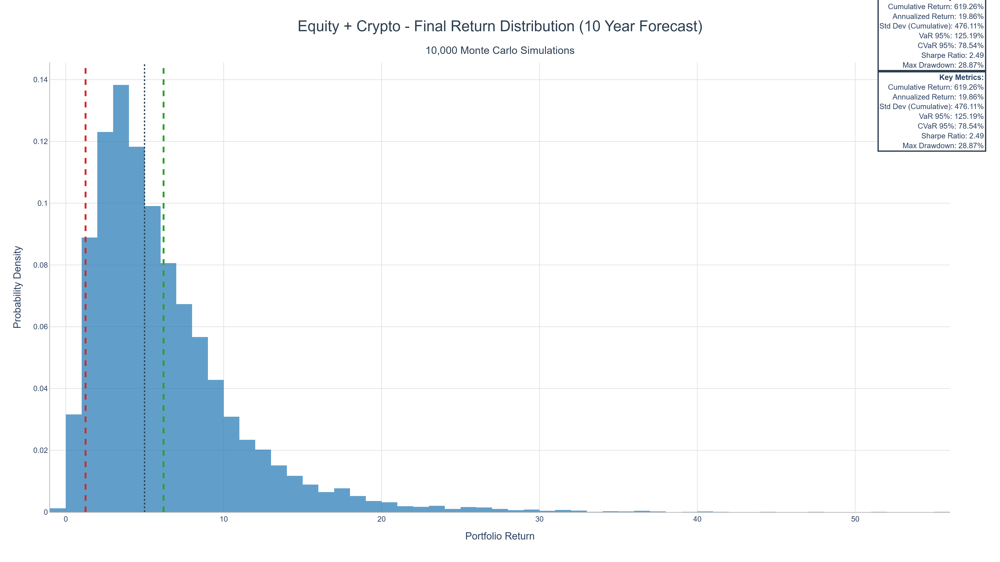

# 📊 Monte Carlo Portfolio Risk Simulator

A professional-grade quantitative finance tool for portfolio risk analysis using Monte Carlo simulation with Geometric Brownian Motion (GBM). This project demonstrates advanced skills in **quantitative programming**, **predictive modeling**, and **risk optimization** for FinTech applications.


---

## 🎯 Project Overview

This simulator analyzes portfolio risk by running **10,000 Monte Carlo simulations** to model potential future returns across multiple asset allocation strategies over a **10-year forecast horizon**. The implementation uses **vectorized NumPy operations** and **Cholesky decomposition** for efficient correlated asset modeling, making it suitable for real-world quantitative finance applications.

### Key Features

- **🔬 Advanced Monte Carlo Simulation**: 10,000+ simulations using Geometric Brownian Motion (GBM)
- **⚡ Vectorized Implementation**: Fully optimized with NumPy matrix operations (no slow Python loops)
- **🔗 Correlated Asset Modeling**: Cholesky decomposition for realistic correlated price movements
- **📈 Comprehensive Risk Metrics**: VaR, CVaR, Sharpe Ratio, Maximum Drawdown (both cumulative and annualized)
- **📊 Professional Visualizations**: LinkedIn-ready high-resolution charts (300 DPI) with percentiles and confidence intervals
- **🎨 Multiple Portfolio Scenarios**: Compare different asset allocation strategies side-by-side
- **📋 Executive Summary**: Automated analysis and insights generation

---

## 🖼️ Sample Visualizations

> **Note:** All charts are automatically generated in high-resolution (300 DPI, scale=3x) for executive presentations and LinkedIn posts.

| 📈 Strategy Comparison | 📉 Risk Distribution |
|---|---|
|  |  |
| *10-year median growth comparison across portfolios with confidence intervals* | *95% VaR and CVaR tail-risk analysis from 10,000 simulations* |

**Generated Visualizations:**
- **Correlation Heatmap**: Asset correlation matrix (SPY, BTC, GLD, BND)
- **Portfolio Path Simulations**: Median paths with 5th-95th and 25th-75th percentile bands
- **Return Distributions**: Histograms showing cumulative and annualized return distributions
- **Metrics Comparison**: Side-by-side bar charts comparing Sharpe ratios, VaR, and drawdowns

---

## 💡 Why This Project?

Traditional "static" portfolio analysis often fails to account for **tail-risk events** and **asset correlations**. By using a Monte Carlo approach:

1. **Uncertainty is Quantified**: We don't just see one possible future; we see 10,000 potential outcomes, allowing investors to understand the full distribution of returns.

2. **Correlation Awareness**: We model how assets move *together* during market stress (e.g., how Gold reacts when the S&P 500 drops, or how bonds provide diversification during equity downturns).

3. **Better Decision Making**: Investors can choose a strategy based on their "Worst Case" (95% VaR) rather than just "Average Case" returns. This is crucial for risk management and portfolio construction.

4. **Professional-Grade Analysis**: The tool provides both cumulative and annualized metrics, ensuring results are comparable across different time horizons and suitable for professional presentations.

---

## 🚀 Technical Highlights

### Mathematical Foundation

**Geometric Brownian Motion (GBM)**
```
dS = μS dt + σS dW
```
Where:
- `μ` = drift (mean return)
- `σ` = volatility (from covariance matrix)
- `dW` = correlated Wiener process (via Cholesky decomposition)
- `μ - 0.5*σ²` = The **Itô's Lemma correction** used in the drift term to ensure the expected value of the distribution aligns with the historical arithmetic mean

**Cholesky Decomposition**
- Enables efficient generation of correlated random shocks
- Transforms uncorrelated standard normal variables into correlated ones
- Essential for realistic multi-asset portfolio simulation
- Applied once and reused across all 10,000 simulations for efficiency

### Architecture

The project follows a **modular, object-oriented design**:

- **`DataFetcher`**: Downloads and preprocesses historical financial data (8 years of history to ensure complete data for all assets including BTC)
- **`PortfolioOptimizer`**: Calculates key statistics (mean returns, covariance matrix, correlation matrix)
- **`MonteCarloSimulator`**: Implements vectorized GBM simulation with correlated shocks
- **`RiskMetrics`**: Computes comprehensive risk and return metrics (both cumulative and annualized)

---

## 📦 Installation

### Requirements

- Python 3.10+
- NumPy, Pandas, Plotly, yfinance, Kaleido

### Setup

```bash
# Clone the repository
git clone <repository-url>
cd monte-carlo-portfolio-risk

# Install dependencies
pip install -r requirements.txt
```

**Note**: `kaleido` is required for exporting high-resolution PNG images. Install it separately if needed:
```bash
pip install kaleido
```

---

## 💻 Quick Start

Simply run the main script:

```bash
python portfolio_simulator.py
```

### What Happens:

1. ✅ **Data Download**: Automatically downloads 8 years of historical data for SPY, BTC-USD, GLD, and BND
2. ✅ **Simulation**: Runs 10,000 Monte Carlo simulations for each portfolio configuration over a 10-year horizon
3. ✅ **Metrics Calculation**: Computes comprehensive risk metrics (VaR, CVaR, Sharpe Ratio, Drawdown) - both cumulative and annualized
4. ✅ **Visualization**: Generates professional high-resolution charts (300 DPI) ready for LinkedIn posts
5. ✅ **Executive Summary**: Prints a comprehensive analysis table with key insights

### Sample Console Output:

```
================================================================================
                         EXECUTIVE SUMMARY
================================================================================

[*] PORTFOLIO RISK ANALYSIS - MONTE CARLO SIMULATION
Assets Analyzed: SPY, BTC-USD, GLD, BND
Simulations per Portfolio: 10,000
Time Horizon: 2520 trading days (10.0 years)

--------------------------------------------------------------------------------
PORTFOLIO PERFORMANCE COMPARISON
--------------------------------------------------------------------------------
      Portfolio Cumulative Return Annualized Return Sharpe Ratio VaR 95% Max DD
     Bond Heavy            86.92%             6.29%         2.19  35.63%  9.57%
Equity + Crypto           619.16%            19.85%         2.49 125.16% 28.87%
     Gold Heavy           287.61%            13.92%         3.08 107.12% 15.55%

Note: Cumulative Return = Total return over 10.0 years
      Annualized Return = Average annual return (geometric mean)

```

---

## 📊 Portfolio Scenarios

The simulator compares three distinct allocation strategies across **4 assets**: **SPY** (S&P 500), **BTC** (Bitcoin), **GLD** (Gold), and **BND** (Total Bond Market):

| Portfolio | SPY | BTC | GLD | BND | Strategy |
|-----------|-----|-----|-----|-----|----------|
| **Bond - heavy** | 30% | 0% | 10% | 60% | Bond-heavy, low volatility, minimal crypto exposure |
| **Equity + Crypto** | 80% | 20% | 0% | 0% | Growth-focused with crypto alpha, balanced equity allocation |
| **Gold Heavy** | 20% | 10% | 50% | 20% | Inflation hedge & safe-haven focused, defensive positioning |

You can easily modify these configurations in the `main()` function of `portfolio_simulator.py`.

---

## 📈 Output & Visualizations

All results are saved to the `results/` directory with timestamped filenames. The directory is automatically cleaned before each run to prevent file accumulation.

### Generated Charts

1. **Correlation Heatmap** (`heatmaps/`)
   - Visual representation of asset correlations across all 4 assets
   - Professional color scheme optimized for presentations
   - Shows how assets move together (or diverge) during market conditions

2. **Portfolio Path Simulations** (`paths/`)
   - Median path with confidence intervals (5th-95th, 25th-75th percentiles)
   - Sample simulation paths for visual context
   - Shaded regions showing uncertainty bands
   - X-axis labeled in years (0Y, 1Y, 2Y, ... 10Y) for clarity

3. **Return Distributions** (`distribution/`)
   - Histogram of 10,000 final cumulative returns
   - Key metrics overlaid (Mean, VaR 95%, Median)
   - Statistical summary box showing both cumulative and annualized metrics
   - Clear visualization of tail risk

4. **Comparison Charts** (`comparison/`)
   - Side-by-side median path comparison across all portfolios
   - Metrics bar charts (Annualized Return, Sharpe Ratio, VaR, Drawdown)
   - Professional formatting suitable for executive presentations

### Console Output

The script prints a comprehensive **Executive Summary** including:
- Portfolio performance comparison table (cumulative and annualized returns)
- Best performers by metric (Sharpe, Annualized Return, Cumulative Return, Risk, Stability)
- Key insights and recommendations
- Clear notes explaining the difference between cumulative and annualized metrics

---

## 📊 Risk Metrics Explained

| Metric | Description | Interpretation |
|--------|-------------|----------------|
| **Cumulative Return** | Total return over the investment horizon | Shows total growth potential (e.g., 350% over 10 years) |
| **Annualized Return** | Average annual return (geometric mean) | Standardized metric for comparison (e.g., 10% per year) |
| **Standard Deviation** | Volatility of returns | Lower = more stable, predictable returns |
| **Sharpe Ratio** | Risk-adjusted return (annualized) | >1 = good, >2 = excellent, >3 = outstanding |
| **VaR 95%** | Maximum expected loss at 95% confidence | Lower (less negative) = safer portfolio |
| **CVaR 95%** | Expected loss if VaR is exceeded | Measures tail risk beyond VaR threshold |
| **Maximum Drawdown** | Largest peak-to-trough decline | Lower = more stable, less volatile portfolio |

---

## 🎓 Learning Outcomes

This project demonstrates proficiency in:

- ✅ **Quantitative Finance**: GBM modeling, risk metrics, portfolio theory, Itô's Lemma
- ✅ **Advanced NumPy**: Vectorization, matrix operations, Cholesky decomposition
- ✅ **Data Science**: Financial data processing, statistical analysis, Monte Carlo methods
- ✅ **Software Engineering**: Modular design, error handling, code organization, type hints
- ✅ **Data Visualization**: Professional charting for business presentations (300 DPI output)
- ✅ **Predictive Modeling**: Monte Carlo simulation for scenario analysis and risk assessment
- ✅ **Business Acumen**: Understanding of portfolio construction, risk management, and investment strategy

---

## 🔧 Technical Implementation Details

### Vectorization Strategy

All simulations run simultaneously using NumPy's tensor operations:
- **10,000 simulations × 2,520 days × 4 assets** = processed in a single matrix operation
- No Python loops in the simulation core
- Cholesky decomposition applied once, reused for all simulations
- Memory-efficient operations using in-place calculations where possible

### Performance

- **Simulation Time**: ~3-8 seconds for 10,000 simulations over 10 years
- **Memory Efficient**: Uses in-place operations where possible
- **Scalable**: Can handle 50+ assets and 100,000+ simulations
- **Data Robustness**: Handles missing data gracefully with retry logic and validation

### Annualization Consistency

The tool correctly calculates both cumulative and annualized metrics:
- **Cumulative Returns**: Total return over the investment horizon (e.g., 350% over 10 years)
- **Annualized Returns**: Geometric mean annual return (e.g., 10% per year)
- **Sharpe Ratio**: Properly annualized using annualized returns and volatility
- This ensures results are comparable and suitable for professional presentations

---

## 📝 Code Quality

- ✅ Fully documented with comprehensive docstrings
- ✅ Type hints throughout (Python 3.10+ compatible)
- ✅ Modular, reusable classes following SOLID principles
- ✅ Robust error handling and data validation
- ✅ Professional code structure with clear separation of concerns
- ✅ Consistent naming conventions and formatting

---

## 🎯 Use Cases

This tool is suitable for:

- **Portfolio Risk Assessment**: Evaluate different allocation strategies before investing
- **Risk Management**: Understand potential losses and volatility under various scenarios
- **Investment Research**: Compare asset allocation approaches quantitatively
- **Educational Purposes**: Learn Monte Carlo simulation in finance
- **Quantitative Analysis**: Foundation for more advanced models (Black-Litterman, factor models)
- **Executive Presentations**: Generate professional charts for stakeholder reports
- **LinkedIn Portfolio**: Showcase quantitative finance and data science skills

---

## 📚 References

- **Geometric Brownian Motion**: Standard model for asset price evolution in quantitative finance
- **Monte Carlo Methods**: Statistical simulation techniques for uncertainty quantification
- **Cholesky Decomposition**: Matrix factorization for generating correlated random variables
- **Itô's Lemma**: Stochastic calculus correction ensuring proper drift term in GBM
- **Modern Portfolio Theory**: Risk-return optimization framework (Markowitz)
- **Value at Risk (VaR)**: Industry-standard risk metric for portfolio risk assessment

---

## 👤 Author

**Portfolio Project** - Quantitative Finance & Data Science

Demonstrating expertise in:
- Quantitative Programming (FinTech)
- Predictive Modeling & Monte Carlo Simulation
- Risk Analysis & Portfolio Optimization
- Professional Data Visualization

---

## 📄 License

This project is open source and available for educational and portfolio purposes.

---

## 🌟 Future Enhancements

Potential improvements for production use:

- [ ] Portfolio optimization (Markowitz, Black-Litterman)
- [ ] Real-time data integration via API
- [ ] Interactive web dashboard (Dash/Streamlit)
- [ ] Additional risk metrics (Sortino ratio, Calmar ratio, Omega ratio)
- [ ] Backtesting framework for strategy validation
- [ ] Multi-period rebalancing strategies
- [ ] Stress testing scenarios (market crashes, inflation spikes)
- [ ] Machine learning integration for volatility forecasting

---

**Built with ❤️ for quantitative finance and data science**
